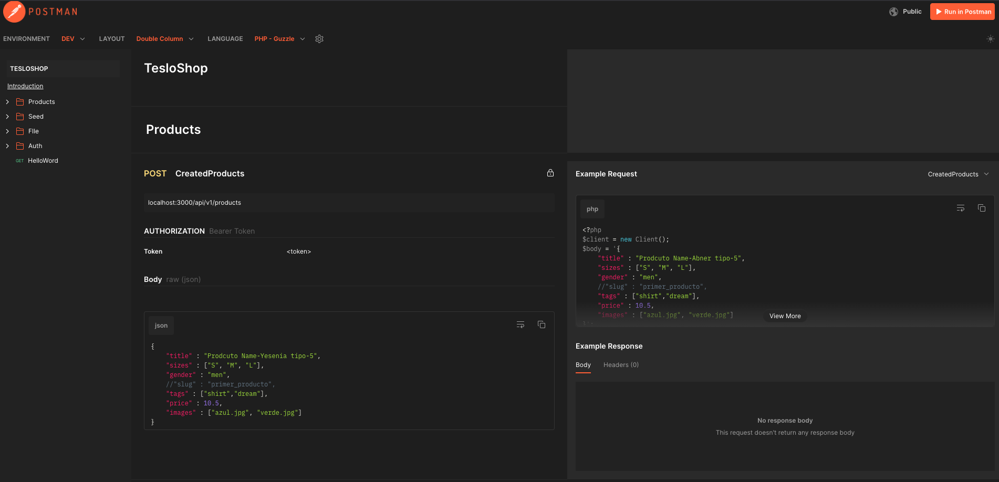

<p align="center">
  <a href="http://nestjs.com/" target="blank"></a>
</p>

# Teslo 
1. Clonar repo

2. Instalar dependencias
```sh
yarn install
```

3. Clonar el archivo `.env.example` y renombrarlo a `.env` establecer variable de entrono 

4. Levantar DB
```sh
docker-compose up -d
```

5. Ejecutar aplicacion
```sh
yarn start:dev
```

6. Ejecucion seeds
```sh
curl --location --request POST 'localhost:3000/api/v1/seed'
```

## Coleccion POSTMAN

Documentacion generada con POSTMAN para el manejo de las colecciones

URL `https://documenter.getpostman.com/view/11149441/2sB2j1isnH#75de8a23-70a7-4c70-b9d6-96a0d1c9a737`


